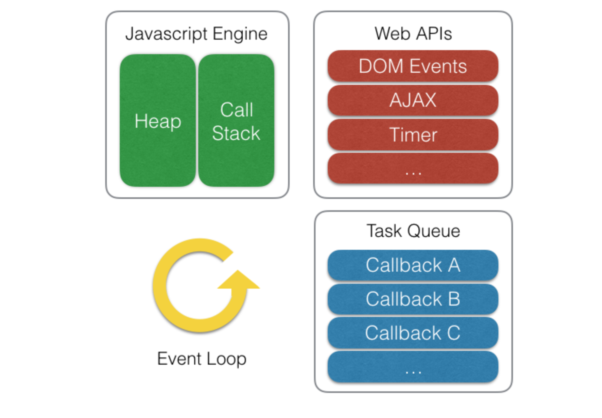

## "자바스크립트의 웹브라우저 동작원리"

- 이벤트 루프란?
Callback Event Queue에서 하나씩 꺼내서 동작시키는 Loop를 뜻한다.

```Javascript
console.log(1+1)
setTimeout(function(){console.log(2+2)},1000)
console.log(3+3)
```
(코드 순서에 상관없이 빠르게 실행가능한 코드부터 실행)

코드 실행시 2,6,4 순으로 콘솔에 찍히는 것을 볼 수 있었다.
혹시 1초 뒤 콘솔이 실행되도록 작성하여 나중에 찍히는 것 인가 생각하여
0초로 변경 뒤 실행 시켜 보았다.
```Javascript
console.log(1+1)
setTimeout(function(){console.log(2+2)},0)
console.log(3+3)
```
마찬가지로 2,6,4 순으로 콘솔에 찍히는 것을 확인하였다.
이것으로 setTimeout 함수는 시간 관계없이 이벤트 루프를 돌게 되는구나 깨달았다.



### 1. 자바스크립트 엔진(V8엔진이고 크롬,node에서 사용)
- Heap : 메모리의 할당이 일어나는 곳 이다(변수를 지정하여 Stack에서 사용하는 등)
- Call Stack : 코드 실행에 따라 호출 스택이 쌓이는 곳 이다.(내가 짠 코드를 실행하는 곳)

### 2. 자바스크립트(Single Thread)
자바스크립트는 싱글 쓰레드 기반의 언어이며, 한번에 한 개의 코드만 처리가 가능하다.

### 3. WepApi
EventListner,DOM,Ajax요청,setTimeOut 등 브라우저에서 제공해주는 API를 WepApi라고 한다.

### 4. Task Queue
WepApi에서 비동기 작업이 실행된 후에 호출된 콜백함수들은 Task Queue에서 기다리게 된다.
__(Stack이 비어있는 경우에만 올려보내지게 된다)__
이벤트 루프가 정해준 순서대로 FIFO(first in first out) 방식을 따른다.
Stack은 하나로 구성되어 있지만 TaskQueue는 Microtask Queue,Animation Frames 등 여러개의 큐로 구성되어 있다.

### 5. 자바스크립트?
자바스크립트는 동기적으로 처리가 된다 이유는 Stack이 하나이고 한줄에 한코드만 실행하기때문인데,
setTimeout,EventListner,Ajax 등을 사용하여 비동기 처리가 가능하다.