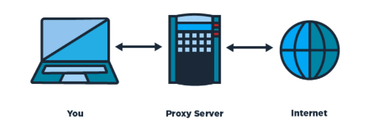

### Proxy/ http-proxy-middleware
```
const {createProxyMiddleware} = require('http-proxy-middleware');
module.exports = function (app) {
    app.use(createProxyMiddleware('/api', {
        target: 'https://openapi.naver.com',
        changeOrigin: true, // 하단 처리는 필수로 해주어야 한다. 아래의 내용이 없으면 url 경로에  api가 추가되어 경로를 찾을 수 없어진다. 
        pathRewrite:{ '^/api/':'/' } }) ) };
```
위는 네이버 Cors이슈로 Sop정책을 충족시키기 위하여 http-proxy-middleware모듈을 설치하여 해결한 사례이다.
따로 setupProxy.js파일을 생성하여 해결하였고, 밑에 작성한 내용처럼 proxy설정을 추가해 줌으로서 /api로 시작되는 API는 target으로 설정된 서버 URI로 호출하도록 설정 된다.(http-proxy-middleware V1.0 이후임)

```
const { createProxyMiddleware } = require('http-proxy-middleware'); 
const apiProxy = createProxyMiddleware('/api', { target: 'http://www.example.org' }); 
                                  // \____/      \_____________________________/
                                        |               |
                                  // context         options 
 // 'apiProxy' is now ready to be used as middleware in a server.
```
context로 설정한 주소가 target으로 설정한 서버 쪽 uri로 proxing된다.

### Proxy란?
클라이언트가 자신(Proxy)을 통해서 다른 네트워크 서비스에 간접적으로 접속할 수 있게 해주는 컴퓨터 시스템이나 응용 프로그램을 말한다.
간단히 말해 주로 보안상의 문제를 방지하기 위해, 직접 통신하지 않고 중계자를 거친다는 개념으로 Proxy라 쓰인다.
프록시 서버가 클라이언트의 Request(요청)와 서버의 Response(응답)를 연결해주기 때문에 클라이언트(사용자) 입장에서는 서버 대신 프록시 서버를 
서버 입장에서는 클라이언트 대신 프록시 서버가 있는 느낌이다.


### Forward Proxy와 Reverse Proxy(프롤시 서버를 사용하는 이유)

1. 시간 절약[Forward Proxy]
    { 클라 <-> 프록시서버 --- 서버 } 
    - 클라이언트가 프록시 서버에 요청한 내용을 프록시 서버에서 캐시로 저장해 두면, 나중에 다시 데이터를 요청할 떄 또다시 데이터를 요청하지 않고 캐시된 데이터를 사용하면 되므로 전송 시간을 절약할 수 있다.
    (캐시(Cache)란 **자주 사용하는 데이터나 값을 미리 복사해 놓은 입시 장소**를 가르킨다.)
    
    사진과 같이 캐시는 다른 저장공간에 비해 **저장 공간이 작고 비용이 비싸지만 빠른 성능을 제공하는 저장공간**이다.
    Cache는 다음과 같은 사례에 사용을 고려하면 좋다.
        - 접근 시간에 비해 원래 데이터를 접근하는 시간이 오래 걸리는 경우(서버의 균일한 API데이터)
        - 반복적으로 동일한 결과를 돌려주는 경우(이미지 또는 썸네일 등)
2. 보안[Reverse Proxy]
    { 클라 --- 프록시서버 <-> 서버 } 
    - 클라이언트가 바로 서버에 데이터를 요청하여 받아볼 수도 있지만, 중요한 데이터가 있는 데이터베이스가 '최전방'에 노출될 수 있다는 위험이 존재한다.
    그렇기 때문에 프록시 서버는 중간에서 내부망을 보호하는 역할을 담당한다.
    즉, 클라이언트가 프록시 서버에 데이터를 요청하면 프록시 서버는 실제 내부 서버에서 데이터를 받아와 클라이언트에서 전달해 주는 것이다.


