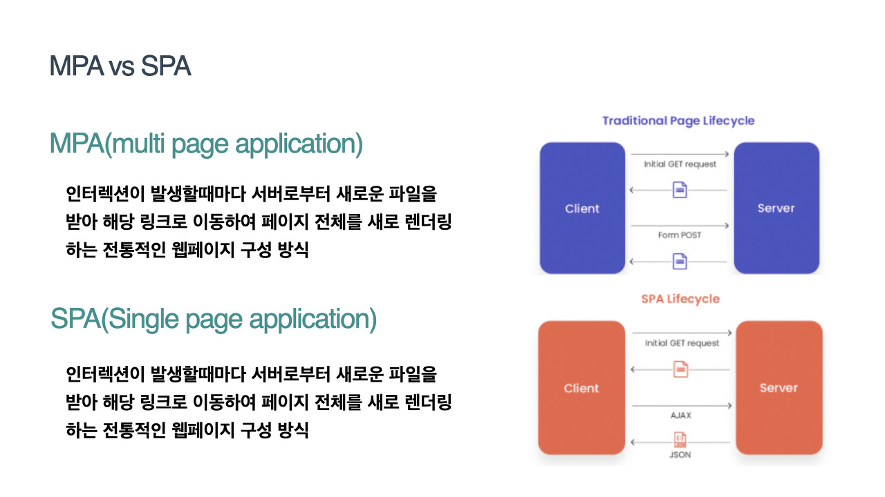
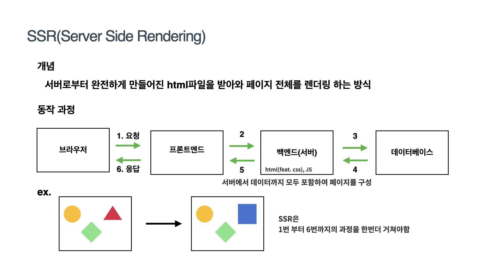

### CSR(Client Side Rendering) vs SSR(Sever Sider Rendering)

__Rendering?__
서버로부터 받은 내용을 브라우저 화면에 표시하는 것

### MPA vs SPA

**MPA(Multi Page Application)**
- 여러 페이지로 구성된 웹 어플리케이션이다.
- 사용자의 클릭과 같은 인터렉션이 발생할 때마다 서버로 부터 새로운 html을 받아와서 해당 링크로 이동한 뒤 페이지 전체를 새로 렌더링하는 전통적인 웹 페이지 구성 방식이다.

**SPA(Single Page Application)**
- 하나의 페이지로 구성된 웹 어플리케이션이다.
- 브라우저 최초 한번만 페이지 전체를 로드하고, 이후부터 필요한 데이터만 Ajax를 통해 데이터를 바인딩하는 방식
- react, vue, angular 등 SPA방식을 가지고 있다.

### SSR
**서버사이드 렌더링의 약자로 서버로부터 완전하게 만들어진 html 파일을 받아와 페이지 전체를 렌더링하는 방식이다.**

1. 클라이언트가 초기 화면을 로드하기 위해 서버에 요청을 보낸다.
2. 서버는 화면에 표시하는데 필요한 데이터를 얻어와 모두 삽입하고 Css까지 모두 적용해서 렌더링 준비를 마친 HTML과 JS코드를 브라우저에 응답으로 전달한다.
3. 브라우저에서 전달 받은 페이지를 띄운 뒤 브라우저가 JS코드를 다운로드하고 HTML에 실행시킨다.

ex) 세모만 네모로 변경하고 싶다면?
세모,네모,마름모까지 모두 서버로부터 다시 다운받아 와야한다.(요청을 보내고 응답 받으면 새로고침되고 화면이 깜빡인 뒤 표시된다.)

### SSR의 장점과 단점

__장정__

1. 페이지 로딩이 CSR에 비해 빨라진다
2. 모든 컨텐츠가 HTML에 답겨져 있기 떄문에 효율적인 SEO가 가능하다.

__단점__

1. 전체적인 웹사이트를 다시 서버에서 받아 오는 것과 동일하기 때문에 (Static Sites)에서 발생했던 Blinking(깜빡임)이슈가 여전히 존재한다.
2. 사용자가 클릭시 전체적인 웹사이트를 다시 서버에서 받아 오는것과 동일하기 때문에 좋지 않은 Use Experience을 겪을 수 있다.
3. 사용자가 많은 제품 일수록 사용자가 클릭 할 때마다 서버에 요청해서 서버에서 필요한 데이터를 가지고와서 HTML을 만들어야 하므로 서버 과부하가 걸리기 쉽다. 
4. 사용자가 빠르게 웹사이트를 확인할 수는 있지만 동적으로 데이터를 처리하는 자바스크립트를 아직 다운받지 못한 상태에서 여기저기 클릭할 시 반응이 없는 경우가 발생할 가능성이 있다.(TTV(Time To View) TTI(Time To Interact))
    - 사이트 접속하면 이미 잘 만들어진 html 파일을 받아옴 -> TTV가능. ->하지만 JS는 받아오지 않아서 TTI는 아님. -> 최종적으로 JS 받아옴 ->TTI 가능

**TTV**
사용자가 웹브라우저에서 내용을 볼 수 있는 시점
**TTI**
사용자가 웹브라우저에서 인터렉션 할 수 있는 시점

!interaction => 컴퓨터와의 상호작용

### CSR
**클라이언트 서버사이드 렌더링의 약자로 사용자의 요청에 따라 필요한 부분만 응답받아 렌더링하는 방식이다.**

HTML은 비어있기때문에 초기 접속화면에는 빈화면만 보이게 된다.

1. 클라이언트에서 초기화면을 로드하기 위해 서버에 요청을 보낸다.
2. 서버는 화면에 표시하는데 필요한 완전한 리소스의 응답을 한다.(어플리케이션에 필요한 로직이나 구동하는 프레임워크와 라이브러리의 소스코드 또한 다 포함되어있다.)
    - 굉장히 사이즈가 크기때문에 다운로드 받는데 시간이 걸린다
3. 추가적으로 필요한 데이터가 있다면 서버에 요청하여 데이터를 받아온 뒤 이 데이터들을 기반으로하여 동적으로 HTML을 생성해 사용자에게 보여지게 된다.

### CSR단점

1. 사용자가 첫 화면을 보기까지 시간이 오래 걸릴 수 있다.
2. 좋지 않은 SEO(Search Engine Optimization)
    - 구글,네이버와 같은 검색엔진들은 서버에 등록된 웹사이트를 하나씩 돌아다니며 웹사이트의 html 문서(title description)를 분석하여
    사용자가 웹사이트를 빠르게 검색할 수 있게 도와주는 것
    - CSR에서 사용되어지는 HTML 바디는 대부분 텅텅 비어있기때문에 검색엔진들이 CSR로 작성된 웹페이지를 분석하는데 많은 어려움을 겪고 있다.