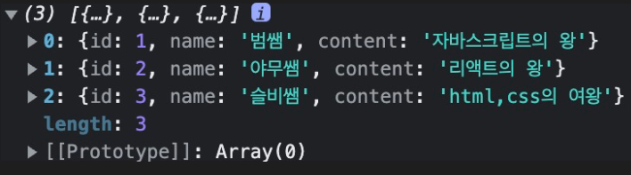
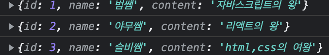

## map함수로 리스트 렌더링하기

```
<!-- props로 넘겨준 data다 라고 가정을 해보자 -->
data = [
     { id: 1, name: "범쌤", content: "자바스크립트의 왕" },
    { id: 2, name: "야무쌤", content: "리액트의 왕" },
    { id: 3, name: "슬비쌤", content: "html,css의 여왕" },
]

const test = (props) =>{
    const dummyData = props.data;
    return(
        <>
        {dummyData.map((el)=>{
            <div>
                <p>{el.id}</p>
                <p>{el.name}</p>
                <p>{el.content}</p>
            </div>
        })}
        </>
    )
}
```

- dummyData
  
- dummyData.map((el)=>{console.log(el)})
  
