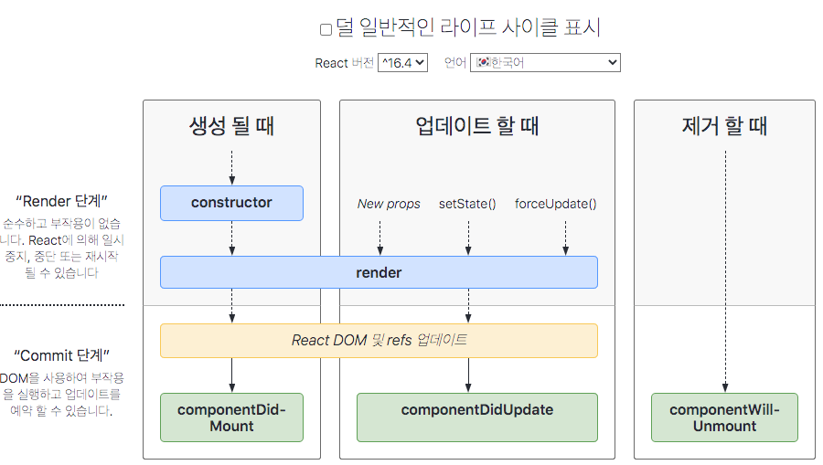

### 라이프 사이클?? (컴포넌트의 생명주기)

**DOM?**

- html 단위 하나하나를 객체로 생각하는 모델이다.
    ex) 'div'라는 객체는 텍스트 노드, 자식 노드 등등 내려가며 하위에 어떤 값을 가지고 있는 것(트리구조)
    DOM이 트리구조라는 뜻이다.

**가상돔?**

- DOM은 트리 중 하나가 수정될 때마다 모든 DOM을 뒤지고, 수정할 것을 찾고 전부 수정하는 과정을 거치다보면 필요없는 연산이 너무 많이 일어난다.
    그래서 등장한게 가상돔이다.

- 가상돔은 메모리 상에서 돌아가는 가짜 DOM이다.(눈에는 보이지 않는다.)

- 동작방식 : 기존 DOM과 어떤 행동 후 새로 그린 DOM(가상돔에 올라갔다는 표현을 쓴다.)을 비교해서 정말 바뀐 부분만 진짜 DOM에 갈아끼워준다.

- 진짜 DOM은 페이지에 처음 진입했을때, 데이터가 변했을때 건드리게된다.

**가상돔? DOM?**

- 무조건 가상DOM을 써야만 DOM보다 빠른 것은 아니고 사이트 구조에 따라 가상DOM이 빠를 수도 DOM이 더 빠를 수도 있다.

**라이프사이클?**

- 컴포넌트의 생명주기를 뜻하며 컴포넌트가 랜더링을 준비하는 순간부터, 페이지에서 사라질 때까지의 과정을 라이프 사이클이라 한다.

- 생성(Mount) => 처음으로 컴포넌트를 불러오는 단계

- 업데이트(Update) => 사용자의 행동(클릭,데이터 입력 등)으로 데이터가 바뀌거나 부모컴포넌트가 랜더링할 때 업데이트 된다.
    - props가 바뀔때 
    - state가 바뀔때
    - 부모 컴포넌트가 업데이트 되었을때(=리렌더링)
    - 강제로 업데이트 했을 경우(forceUpdate()를 통하여 강제로 컴포넌트 업데이트 가능)

- 제거(Unmount) => 페이지를 이동하거나, 사용자의 행동(삭제 버튼 클릭 등)으로 인해 컴포넌트가 화면에서 사라지는 단계

**라이프 사이클 함수**

- 라이프 사이클 함수는 클래스형 컴포넌트에서만 사용할 수 있다.
    (리액트 공식 매뉴얼에서는 함수형 컴포넌트를 더 권장한다.)

- 리액트 16.8버전 부터 등장한 React Hooks으로 라이프 사이클 함수를 대체할 수 있지만 클래스형 컴포넌트에서 사용하는 라이프 사이클 함수처럼 
  한 눈에 보기 어렵다.

__constructor()__
* 생성자 함수라고 부른다. 컴포넌트가 생성되면 가장 처음 호출된다.

__render()__
* 컴포넌트의 모양을 정의한다(state, props에 접근해서 데이터를 보여줄 수 있다.)
* render()안에 들어갈 내용은 컴포넌트의 모양에만 관여하는 것이 가장 좋고 state,props를 건드려 데이터를 수정하려하면 안된다.

__componentDidMount()__
* 컴포넌트가 화면에 나타나는 것을 Mount한다고 표현한다. DidMount()는 마운트가 완료되었다는 말이다.
* componentDidMount()는 첫 번째 랜더링을 마친 후에 딱 한번 실행된다(컴포넌트가 리렌더링할때는 실행되지 않음)
* ajax요청, 이벤트 등록, 함수 호출 등 작업을 처리한다.
* 이미 가상돔이 실제돔으로 올라간 후 이기때문에 DOM관련 처리를 해도 무방하다.

__componentDidUpdate(prevProps, prevState, snapshot)__
* DidUpdate는 리렌더링을 완료한 후 실행되는 함수이다.
* componentDidUpdate()에서는 preProps와 prevState 2개의 파라미터가 존재하는데 각각 업데이트 되기전 props와 state를 의미한다. 이전 데이터와 비교할 일이 있다면
가져다 써도 된다.
* 이미 가상돔이 실제돔으로 올라간 후 이기때문에 DOM관련 처리를 해도 무방하다.

__componentWillUnmount()__
* 화면에서 완전히 사라지기 직전에 호출된다.
* 삼항연선자를 사용하여 컴포넌트를 보여주고나, 없애는 것을 조건부 렌더링이라고 부른다.